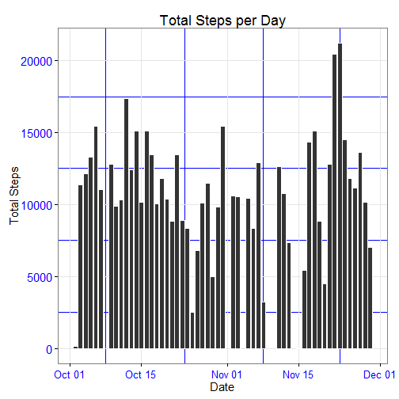
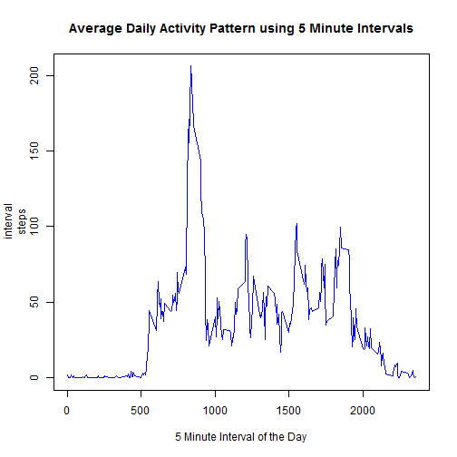
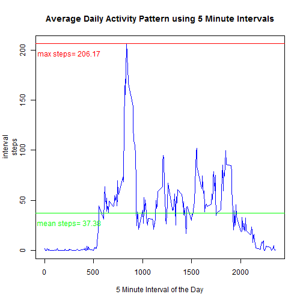
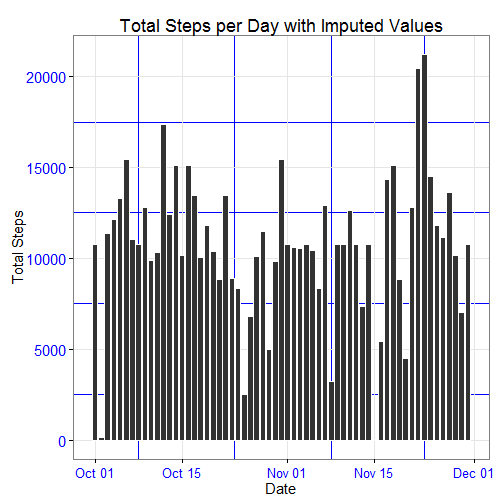
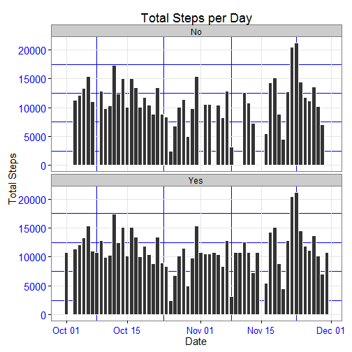
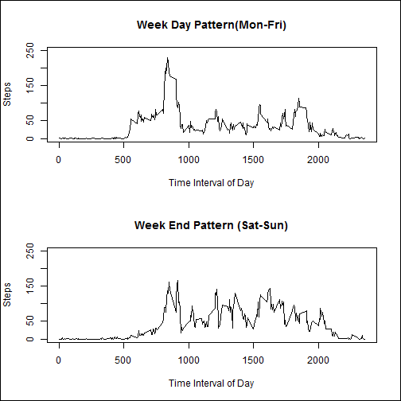
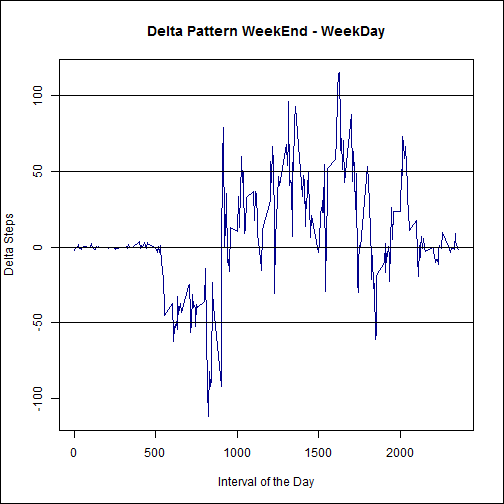
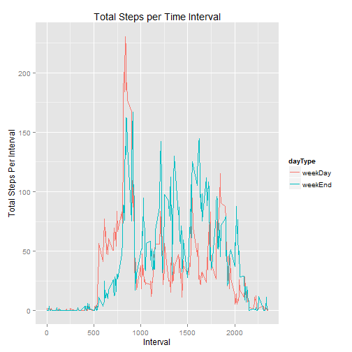

<br>
<br>
<br>
<br>
<br>


#       Exploratory Analysis of Raw data for Activity Monitoring

<br>
<br>
<br>
<br>
<br>
This is the Peer Assigment #1 for the Cousera class "Reproducible Research".  Please note that I have included a couple of extra plots and calculations.

*****


## Loading and preprocessing the data

The first step here is to load the data. The data can be found at (https://d396qusza40orc.cloudfront.net/repdata%2Fdata%2Factivity.zip). The program checks to see if the file activity.csv already exists in the current working directory. If it does not, it then downloads the zip file and unzips it into the current working directory.

```r
setwd("C:/Users/kellym/coursera/RepData_PeerAssesment1/RepData_PeerAssessment1")
library("ggplot2")
#############################################################
# Set the file name and url variables.
#############################################################
zipName <- "activity.zip"
fileName <- "activity.csv"
fileUrl <- "https://d396qusza40orc.cloudfront.net/repdata%2Fdata%2Factivity.zip"

#############################################################
# Check to see if the csv file exists in the current working 
#  directory. If not, download the zip file and unzip it.
#############################################################
if(!file.exists(fileName)){
    download.file(fileUrl,destfile=zipName, mode="wb")
    unzip(zipName)
}
```

After downloading the file, it is loaded into a dataframe (DF) **data** using read.table. 

```r
#############################################################
# Load the activity.csv data into the data df.
#############################################################
data <- read.table(fileName
                     ,quote = "\""
                     , sep=","
                     , header=TRUE
                     , na.strings="NA"
                     , colClasses=c("numeric","Date","integer")
)
```

A column is added to the **data** DF in order to view the interval and date as a full date-time value. In order to do this, the function interval_date.Time was used.

```r
interval_date.Time = function(date, interval){
       strptime(paste(date
                      ,sprintf("%04d",interval)
                      )
                      ,"%Y-%m-%d %H%M"
                )
}
#
### Add a combined columns to data for date and time
#
data$date.Time <- interval_date.Time(data$date,data$interval)
```

*****

## What is mean total number of steps taken per day?

Part A, In order to get the total number of Steps per day we can ignore missing data. We first aggregate the DF data into a new DF called **steps_by_day**. 

```r
# Calculate the total steps per day
steps_by_day <- aggregate(. ~date, data[,c("steps","date")], sum, na.rm=TRUE)
```

A plot of the total number of steps per day in the "activity.csv" data set is shown below.

```r
p <- ggplot(steps_by_day, aes(date, steps))
p <- p + geom_histogram(stat="identity",colour="white")
p <- p + theme_bw( base_size=15 ) + 
     labs(title="Total Steps per Day"
           ,x="Date"
           ,y="Total Steps"
     ) +
    
    theme(axis.text.x = element_text(color="blue"
                                     ,size=13
                                     ,angle=0
                                     ,vjust=0.5
                        ) ,
    axis.text.y = element_text(color="blue"
                               ,size=15
                               ,angle=0
                               ,vjust=0.5
    ) ,
    panel.grid.minor.x=element_line(size = 0.1,color="blue"),
    panel.grid.minor.y=element_line(size = 0.1,color="blue")
) 
print(p)
```

 


The mean Number ofsteps per day is:


```r
print(mean(as.numeric(steps_by_day$steps), na.rm=TRUE))
```

```
## [1] 10766.19
```

and the median of steps per day is:


```r
print(median(as.numeric(steps_by_day$steps), na.rm=TRUE))
```

```
## [1] 10765
```

****************************
## What is the average daily activity pattern?

Next, we determine the overall daily activity pattern, we will calculate the average number of steps that were taken during each of the 5 minute intervals throughout the day. In order to do this we first aggregate the DF data into a new DF called **mean_steps_per_interval**. We calculate the interval means as:


```r
mean_steps_per_interval <- aggregate(. ~interval, data[,c("steps","interval")], mean, na.rm=TRUE)
```

Here is a plot for the average daily activity: 

```r
plot(mean_steps_per_interval, aes(interval, steps), type="l"
     ,xlab="5 Minute Interval of the Day"
     ,col="blue"
)
title ("Average Daily Activity Pattern using 5 Minute Intervals")
```

 

The 5 minute interval that has the maximun average number of steps is:

```r
max_avg <- max(as.numeric(mean_steps_per_interval$steps), na.rm=TRUE) 
print(max_avg)
```

```
## [1] 206.1698
```

Let us also calcuate the mean average number of steps taken per interval:

```r
mean_avg <- mean(as.numeric(mean_steps_per_interval$steps), na.rm=TRUE) 
print(mean_avg)
```

```
## [1] 37.3826
```

Now let us replot the daily activity again and overlay it with a line at the max value and the mean values:

```r
plot(mean_steps_per_interval, aes(interval, steps), type="l"
     ,xlab="5 Minute Interval of the Day"
     ,col="blue"
)
title ("Average Daily Activity Pattern using 5 Minute Intervals")
abline(col="red", ,text(250,(max_avg - 10 ), paste("max steps=",round(max_avg,digits=2)), col = "red"), h=max_avg)
abline(col="green", ,text(250,(mean_avg - 10 ), paste("mean steps=",round(mean_avg,digits=2)), col = "Green"), h=mean_avg)
```

 

## Imputing missing values
We find that the data set has a large number of missing values for the steps variable. The total number of records with missing step values is:

```r
number_missing_values <- sum(is.na(data$steps)==TRUE)
print(number_missing_values)
```

```
## [1] 2304
```

Next, we impute the missing values into a new data set called **new_data**. First we create **new_data** as a copy of **data**. Now the the strategy used to populate the missing step values is to calculate the mean value of its interval during the day across the entire data set. This information is already stored in the dataset **mean_steps_per_interval**. We loop over the rows in **data** and copy the step value if it exists or replace it with the calculated mean if is missing with the value for that interval in **mean_steps_per_interval**.

```r
new_data <- data    
x <- mean_steps_per_interval # create a temporary df x
for(i in 1:nrow(data) ){
    if(is.na(data[i,1])){
        i_interval <- data[i,"interval"]
        new_data[i,1] <- x[x$interval==i_interval,]$steps
    }
    else{ new_data[i,1] <- data[i,1]}
}
rm(x)
```

A check of **new_data** for missing values shows that it does not have any missing values. The number of new_data missing vaules is:

```r
new_data_missing_values<- sum(is.na(new_data$steps)==TRUE)
print(new_data_missing_values)
```

```
## [1] 0
```

Next we want to create a histogram of the total steps per day for the new data set **new_data** and then compare it to the data set with the missing values. First aggregate the new data DF into a new DF called **new_steps_by_day** over steps and date as we did in the original histogram.

```r
new_steps_by_day <- aggregate(. ~date, new_data[,c("steps","date")], sum, na.rm=TRUE)
```

Now, plot the histogram for the total number of steps per day:

```r
p <- ggplot(new_steps_by_day, aes(date, steps))
p <- p + geom_histogram(stat="identity",colour="white")
p <- p + theme_bw( base_size=15 ) + 
    labs(title="Total Steps per Day with Imputed Values"
         ,x="Date"
         ,y="Total Steps"
    ) +
    
    theme(axis.text.x = element_text(color="blue"
                                     ,size=13
                                     ,angle=0
                                     ,vjust=0.5
    ) ,
    axis.text.y = element_text(color="blue"
                               ,size=15
                               ,angle=0
                               ,vjust=0.5
    ) ,
    panel.grid.minor.x=element_line(size = 0.1,color="blue"),
    panel.grid.minor.y=element_line(size = 0.1,color="blue")
    ) 
print(p)
```

 

The mean of the new data set with the imputed values is not much different that the mean of the original data set with missing values and the same for the median.
The mean new steps per day for new_data is:

```r
print(mean(as.numeric(new_steps_by_day$steps), na.rm=TRUE))
```

```
## [1] 10766.19
```

The median of the New distribution of steps per day is: 

```r
print(median(as.numeric(new_steps_by_day$steps), na.rm=TRUE))
```

```
## [1] 10766.19
```

To better see the differences, let us make a panel plot of the new and original histograms for steps per day. We will add a new factor column **imputed**, which can be Yes or No, to the **steps_by_day** and new_steps_by_day** DF's.

```r
steps_by_day$imputed <- "No"
new_steps_by_day$imputed <- "Yes"
```

Then we rbind them into a new DF **all_steps_by_day**

```r
all_steps_by_day <- rbind(steps_by_day, new_steps_by_day)
```

Here is a panel plot of the steps per day comparing the original data set and the new imputed data set:

```r
par(mfrow=c(2,1)) # divide window into 2
p <- ggplot(all_steps_by_day, aes(date, steps)) + facet_wrap(~imputed,nrow=2)
p <- p + geom_histogram(stat="identity",colour="white")

p <- p + theme_bw( base_size=15 ) + 
     labs(title="Total Steps per Day"
           ,x="Date"
           ,y="Total Steps"
     ) +
    
    theme(axis.text.x = element_text(color="blue"
                                     ,size=13
                                     ,angle=0
                                     ,vjust=0.5
                        ) ,
    axis.text.y = element_text(color="blue"
                               ,size=15
                               ,angle=0
                               ,vjust=0.5
    ) ,
    panel.grid.minor.x=element_line(size = 0.1,color="blue"),
    panel.grid.minor.y=element_line(size = 0.1,color="blue")
) 
print(p)
```

 

****************************
## Are there differences in activity patterns between weekdays and weekends?
First, let us add a factor columns to the new_data DF for the day of the week and the week day type weekDay or weekEnd. We use a function called dayType to determine if it is a week day or weekend.

```r
dayType <- function(weekDay){
    if (weekDay %in% c("Mon","Tue","Wed","Thu","Fri")) dayType <- "weekDay"
    if (weekDay %in% c("Sat","Sun")) dayType <- "weekEnd"
    return(dayType)
}

new_data$dayOfWeek <- weekdays(new_data$date.Time, abbreviate = TRUE)
new_data$dayType <- sapply(new_data$dayOfWeek, FUN=dayType)
```

Now, create two seperate DF's, **weekDays** which aggregates the 5 minute intervals all all week days (Mon,Tue,Wed,Thu,Fri) over the entire date range and a second which aggregates the 5 minute intervals all all week days (Sat,Sun)

```r
weekDays <- aggregate(. ~interval, new_data[new_data$dayType=="weekDay",c("steps","interval")], mean, na.rm=TRUE)
weekEnds <- aggregate(. ~interval, new_data[new_data$dayType=="weekEnd",c("steps","interval")], mean, na.rm=TRUE)
#### Rename the Columns
names(weekDays) <- c("interval","weekDaySteps")
names(weekEnds) <- c("interval","weekEndSteps")
```

A panel plot for the week end and week day distributions is shown below: 

```r
par(mfrow=c(2,1)) # divide window into 2
plot(weekDays$interval, weekDays$weekDaySteps,type="l"
     ,xlab="Time Interval of Day"
     ,ylab="Steps"
     ,ylim=c(0,250))
title ("Week Day Pattern(Mon-Fri)")
plot(weekEnds$interval, weekEnds$weekEndSteps,type="l"
     ,xlab="Time Interval of Day"
     ,ylab="Steps"
     ,ylim=c(0,250))
title ("Week End Pattern (Sat-Sun)")
box(which="outer", lty="solid")
```

 

Another way to view the difference is to subtract one distribution from the other. So we first merge the two new data sets **weekDays** and **weekEnds**: 

```r
weekDay_all <- merge(weekDays,weekEnds
                      ,by.weekDays="interval"
                      ,by.weekEnds="interval"
                      ,all=TRUE
)
```

Now, we plot the difference of the interval values between the two data sets **weekDays** and **weekEnds**.

```r
par(mfrow=c(1,1)) # divide window into 1
plot(weekDay_all$interval, (weekDay_all$weekEndSteps - weekDay_all$weekDaySteps),type="l"
     ,xlab="Interval of the Day"
     ,ylab="Delta Steps"
     ,col="darkblue"
     ,main="Delta Pattern WeekEnd - WeekDay")
abline(h=0,abline(h=c(-50, 50,100)))
box(which="outer", lty="solid")
```

 

Finally, we will also add an overlay plot showing the two distributions. We will add the factor dayType to the two data sets **weekDays** and **weekEnds**. The we rbind these data sets into a new data set called **weekDay_interval:

```r
#################################
# Now put on the same plot
#################################
weekDays$dayType <- "weekDay"
weekEnds$dayType <- "weekEnd"
names(weekDays) <- c("interval","steps","dayType")
names(weekEnds) <- c("interval","steps","dayType")
weekDay_interval <- rbind(weekDays,weekEnds)
```

Here is the resulting overlay plot showing the two distributions:

```r
qplot(interval, steps, data = weekDay_interval, group = dayType, color = dayType,
      geom = c("line"), ylab = expression("Total Steps Per Interval"), 
      xlab = "Interval", main = "Total Steps per Time Interval")
```

 


